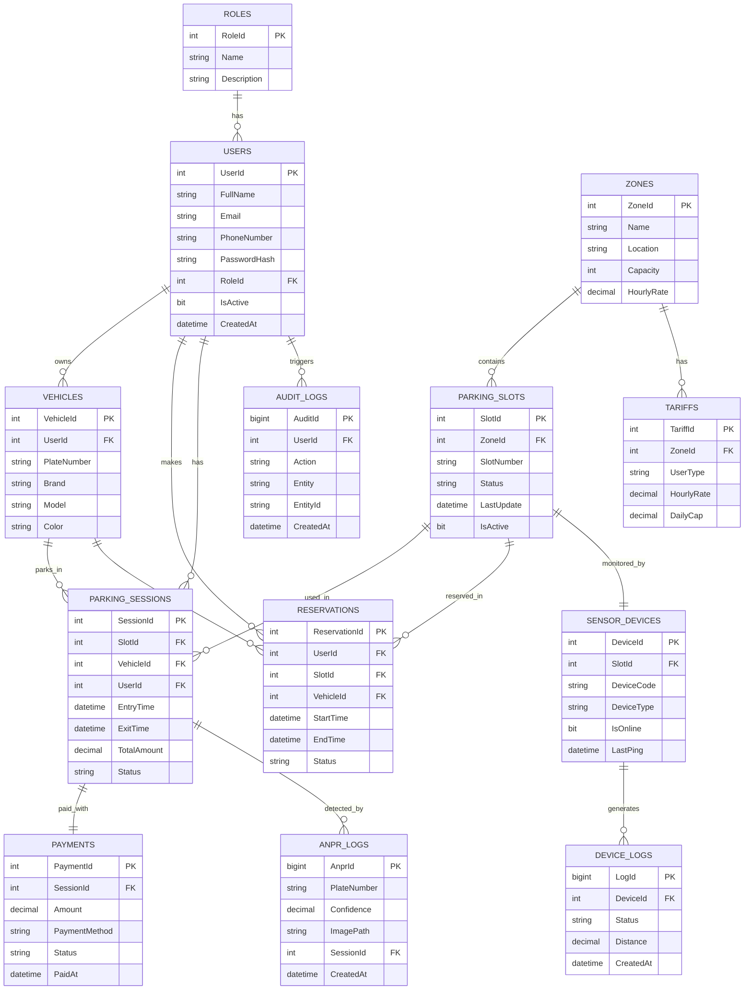

# ER Diagram – Smart Parking Management System

Diagrami i meposhtem eshte shkruar ne `Mermaid`. Mund ta hapesh ne:
- `GitHub` (rendet automatikisht)
- `draw.io` (import nga Mermaid)
- `Mermaid Live Editor`: https://mermaid.live

## Relacionet kryesore
- `Roles` 1:N `Users`
- `Users` 1:N `Vehicles`, `Reservations`, `ParkingSessions`
- `Zones` 1:N `ParkingSlots`, `Tariffs`
- `ParkingSlots` 1:1 `SensorDevices`
- `ParkingSlots` 1:N `ParkingSessions`, `Reservations`
- `ParkingSessions` 1:1 `Payments`
- `ParkingSessions` 1:N `AnprLogs`
- `SensorDevices` 1:N `DeviceLogs`
